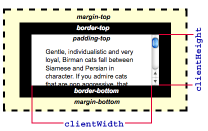

## 화면 너비 표현 차이
### window.screen.width
모니터 화면 자체 너비

### Window.outerWidth
브라우저 윈도우의 사이드바와 가장자리 경계선을 포함한 바깥쪽의 폭을 얻어온다.

### Window.innerWidth
브라우저 윈도우의 뷰포트 너비로, 수직 스크롤바가 존재한다면 포함한다.

### Element.clientWidth
테두리, 스크롤바 제외한 너비. padding은 포함하지만 margin은 포함하지 않는다

## clientX, clientY
브라우저 화면을 기준으로 가로, 세로 좌표 제공한다. (스크롤 무시)

## pageX, pageY
문서 전체를 기준으로 좌표를 반환한다. (스크롤 포함)

## screenX, screenY
브라우저 화면이 아닌 모니터 화면을 기준으로 좌표를 제공한다.

## offsetX, offsetY
이벤트 대상이 기준이 된다. 스크롤 화면을 포함해 전체 문서를 기준으로 한다. (?)
---
### 출처
- https://developer.mozilla.org/ko/docs/Web/API/Window/innerWidth
- https://developer.mozilla.org/en-US/docs/Web/API/Element/clientWidth